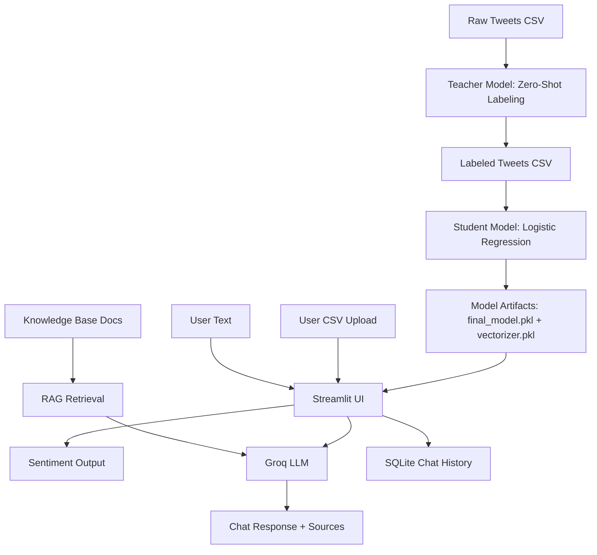
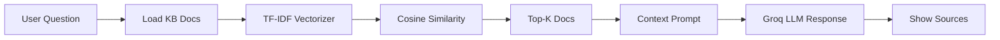
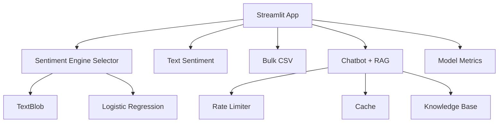

# Working Notes: Scam Bridge Analytica (A → Z)

This document explains how every major component works, end to end, from data preparation to UI rendering and RAG‑based chat.

---

## Architecture Diagrams

### 1) End‑to‑End System Flow

### 2) RAG Retrieval Pipeline

### 3) Streamlit UI Modules

---

## A) Data Sources and Inputs

**Primary inputs**
- `data/political_tweets.csv` — raw, unlabeled tweets (source data for training).
- `data/knowledge_base/*.txt|*.md` — documents used for retrieval‑augmented responses.

**Secondary inputs**
- User text in the Streamlit UI (for real‑time sentiment).
- User‑uploaded CSV (for bulk analysis).

---

## B) Auto‑Labeling (Teacher Model)

**File:** `functions/label_data.py`  
Purpose: label raw tweets using a zero‑shot classifier.

**Flow**
1. Load `data/political_tweets.csv`
2. Use Hugging Face transformers to label each tweet as:
   - `positive`, `negative`, or `neutral`
3. Save labeled output to:
   - `data/labeled_political_tweets.csv`

This creates a training dataset without manual annotation.

---

## C) Model Training (Student Model)

**File:** `functions/model_trainer.py`  
Purpose: train a lightweight Logistic Regression model.

**Flow**
1. Load `data/labeled_political_tweets.csv`
2. Clean text using `functions/preprocess.py`
3. Vectorize with **TF‑IDF**
4. Train Logistic Regression
5. Save artifacts:
   - `models/final_model.pkl`
   - `models/vectorizer.pkl`

These artifacts power the Logistic Regression sentiment engine in the app.

---

## D) Preprocessing Utilities

**File:** `functions/preprocess.py`  
Purpose: normalize input text for ML.

**Key steps**
- Remove URLs, mentions, hashtags
- Strip punctuation
- Lowercase
- Remove stopwords
- Apply stemming

Used during model training and Logistic Regression inference.

---

## E) Streamlit App Entry Point

**File:** `app.py`  
Purpose: orchestrates UI, sentiment engines, chat, RAG, and storage.

**Major sections**
1. **Global UI theme**
   - CSS injected for visual style (Samsung/Apple/cyber themes depending on last change).
2. **Sentiment engine selection**
   - TextBlob or Logistic Regression.
3. **Text sentiment analysis**
   - User enters text → sentiment output + score.
4. **Bulk CSV analysis**
   - User uploads CSV → select column → labeled output.
5. **LLM chatbot (Groq)**
   - Optional RAG + caching + rate limiting.
6. **Model performance**
   - Static report shown in UI.

---

## F) Sentiment Engines

### 1) TextBlob
**Flow**
1. Input text → TextBlob polarity
2. Label = Positive / Negative / Neutral
3. Score = polarity (−1 to +1)

### 2) Logistic Regression
**Flow**
1. Input text → preprocess
2. Vectorize with saved TF‑IDF
3. Model predicts class + confidence
4. Label = Positive / Negative / Neutral

---

## G) Bulk CSV Processing

**Flow**
1. Upload CSV
2. Choose text column
3. For each row:
   - run sentiment engine
4. Append:
   - `Sentiment`
   - `Polarity_Score` or `Confidence`
5. Show preview + allow download

---

## H) Groq LLM Chatbot

**Flow**
1. User submits question
2. Rate limiter checks request limit
3. If RAG enabled:
   - Retrieve relevant KB docs
4. Build prompt (system + context + question)
5. Groq API returns answer
6. Sources (filenames) shown under answer

---

## I) RAG (Retrieval Augmented Generation)

**Files:** `data/knowledge_base/*.txt|*.md`

**Flow**
1. Load all KB documents
2. Vectorize docs using TF‑IDF
3. Compute cosine similarity
4. Select top‑K docs
5. Inject doc snippets into prompt
6. Display source filenames

---

## J) Chat History Storage

**Storage:** `data/chat_history.db`

**Flow**
1. Each chat saved with:
   - user message
   - bot response
   - sentiment label + score
   - sources
2. Only latest 200 stored
3. Sidebar button clears history

---

## K) Sidebar Settings

**Available controls**
- Groq API key override
- Toggle RAG
- Select top‑K sources
- Toggle cache
- Rate limit per minute
- Clear chat history

---

## L) Caching

**Purpose**
- Avoid repeated calls for same question + settings.

**Key**
- Query + RAG on/off + top‑K

---

## M) Rate Limiting

**Purpose**
- Prevent API abuse and reduce cost.

**How**
- Tracks timestamps in session
- Blocks after N requests per minute

---

## N) Output Summary (A → Z)

**A–D**: Data prep → labeling → training → preprocessing  
**E–G**: Streamlit UI → sentiment → bulk analysis  
**H–M**: Chat + RAG → storage → caching → limits  

Everything is wired through `app.py`, which connects ML, RAG, and UI into one flow.
